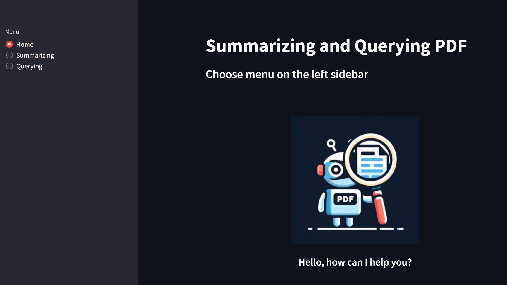
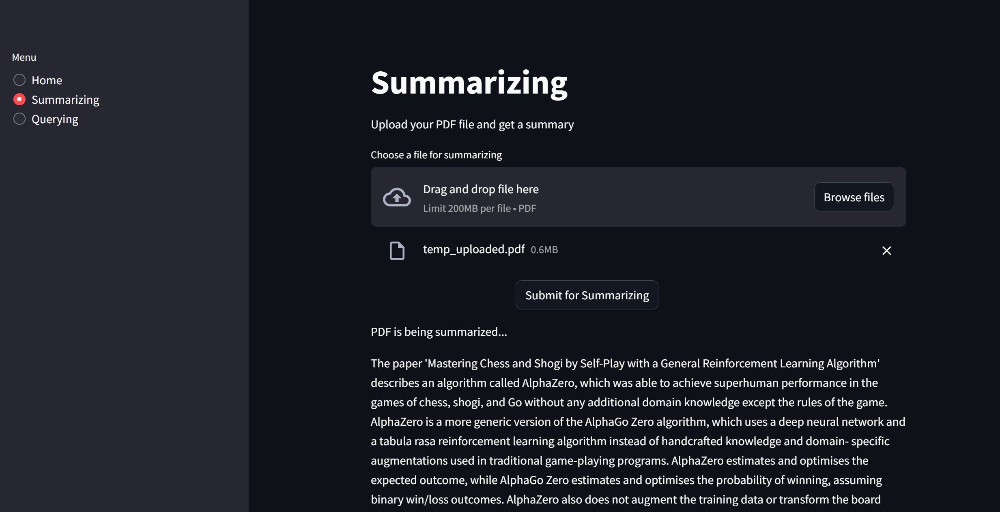
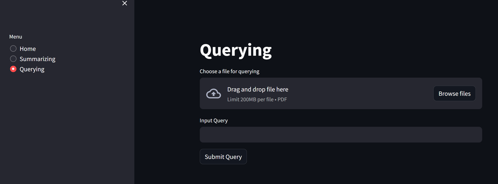
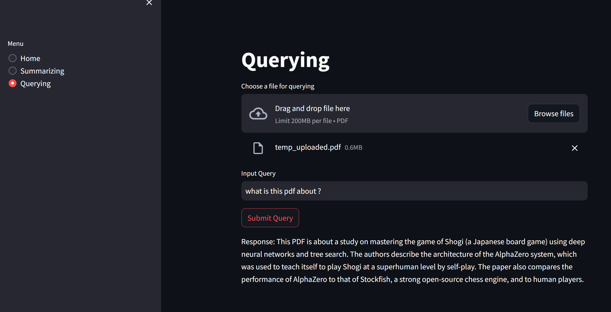

# PDF-Summarization-and-Querying

## Getting started

1. Cloning the repo
```bash
git clone https://github.com/RafeedArian99/PDF-Summarization-and-Querying.git
```
2. Creating and using a virtual env
```bash
virtualenv venv
source venv/bin/activate
```

3. Installing dependencies
```bash
pip3 install -r PDF-Summarization-and-Querying/requirements.txt
```

4. Exporting hugging face token
```bash
# replace $TOKEN with your token
echo "HUGGINGFACEHUB_API_TOKEN=\"$TOKEN\"" > .env
```

5. Running the application
```bash
streamlit run PDF-Summarization-and-Querying/app.py
```


---
## Select Summarizing or querying



## Summarizing

1. Upload file and hit submit



## Querying

1. Upload file



2. Query



---

